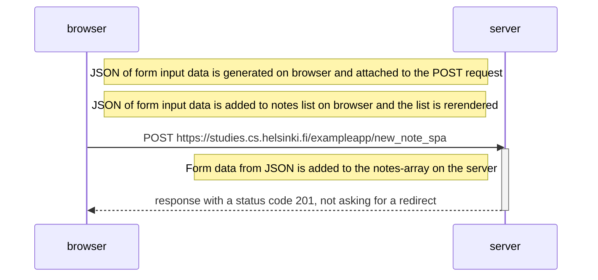

```mermaid
sequenceDiagram
    participant browser
    participant server

    Note right of browser: JSON of form input data is generated on browser and attached to the POST request
    Note right of browser: JSON of form input data is added to notes list on browser and the list is rerendered
    browser->>server: POST https://studies.cs.helsinki.fi/exampleapp/new_note_spa
    

    activate server
    Note left of server: Form data from JSON is added to the notes-array on the server
    server-->>browser: response with a status code 201, not asking for a redirect
    deactivate server


```
